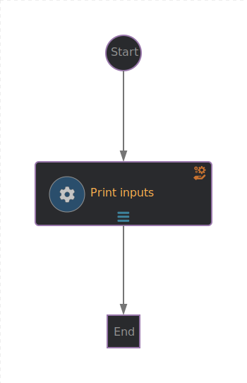

# Basic workflow
The basic workflow is a hello world kind of workflow: it send a notification and log into the console the input project name

## Workflow application configuration
Application properties can be initialized from environment variables before running the application:

| Environment variable  | Description | Mandatory | Default value |
|-----------------------|-------------|-----------|---------------|
| `BACKSTAGE_NOTIFICATIONS_URL`      | The backstage server URL for notifications | ✅ | |
| `NOTIFICATIONS_BEARER_TOKEN`      | The authorization bearer token to use to send notifications | ✅ | |


## Input
- `OCP project to create` [required] - the OCP project to be created on the OCP cluster.
- `Recipients` - the recipients of the notifications, automatically populated thanks to the custom UI plugin.

## Workflow diagram


## Installation

Use the scripts:
* Build and push the image:
```
./build-push.sh basic 01_basic
```
* Generate manifests that have to be applied on the OCP cluster wiht RHDH and OSL:
```
./gen-manifest.sh basic 01_basic
```
The manifests location will be displayed by the script.

To apply the manifests, run:
```
TARGET_NS=sonataflow-infra
oc -n ${TARGET_NS} apply -f <path to manifests folder>
```

Once the manifests are deployed, set the environements variables needed:
```
TARGET_NS=sonataflow-infra
WORKFLOW_NAME=basic
BACKSTAGE_NOTIFICATIONS_URL=http://backstage-backstage.rhdh-operator
oc -n ${TARGET_NS} patch secret "${WORKFLOW_NAME}-creds" --type merge -p '{"data": { "NOTIFICATIONS_BEARER_TOKEN": "'$(oc get secrets -n rhdh-operator backstage-backend-auth-secret -o go-template='{{ .data.BACKEND_SECRET  }}')'"}}'

oc -n ${TARGET_NS} patch sonataflow "${WORKFLOW_NAME}" --type merge -p '{"spec": { "podTemplate": { "container": { "env": [{"name": "BACKSTAGE_NOTIFICATIONS_URL",  "value": "'${BACKSTAGE_NOTIFICATIONS_URL}'"}]}}}}'
```