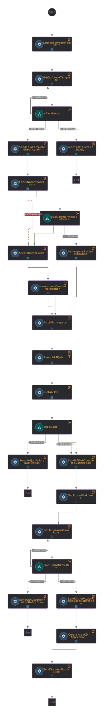

# Deploy Application with PostgreSQL Installed by Ansible Automation Platform (AAP)

This guide walks you through a workflow that creates and deploys an application along with its required components. Below is a breakdown of the process:

1. **Application and GitOps Repositories Creation**:  
   Using Backstage software templates, the workflow creates:
   - A GitHub repository containing the application source code and CI configuration using GitHub actions.
   - A GitOps repository for managing the deployment workflow.

2. **Monitoring GitHub Action Completion**:  
   The workflow ensures the application is successfully built, and its container image is pushed to the image registry.

3. **PostgreSQL Deployment**:  
   The workflow uses AAP to deploy a PostgreSQL instance on an OpenShift Container Platform (OCP) cluster for the application.

4. **Application Deployment**:  
   The workflow deploys the application on the OCP cluster using Red Hat OpenShift GitOps (ArgoCD).

---
## Workflow Demo
See [demo recording](https://www.youtube.com/watch?v=ApDemFgkjqo).

## Workflow Diagram



---

## Requirements

1. **OCP Cluster**
2. **RHDH Configuration**:  
   - Orchestrator plugins version >= 1.3.  
   - GitHub provider.  
   - ArgoCD plugin.  
   - PetClinic software template imported from [spring-petclinic-software-template folder](./spring-petclinic-software-template).

3. **OpenShift GitOps/ArgoCD**
   - see [how we do it](https://github.com/rhdhorchestrator/orchestrator-go-operator/tree/main/docs/gitops#install-openshift-gitops-operator-1)
5. **Image Registry**:  
   - Quay.io (default) with a target repository created.
6. **AAP** with [Ansible playbook](./postgres_playbook/psql.yaml) imported (details below)

---

## Building and deploying the Workflow

To build the workflow image and push it to the image registry, use the [./scripts/build.sh](../scripts/build.sh) script:
```bash
../scripts/build.sh --help
```

Provide the desired values to the env variables and run the following command from the current directory, e.g.:

1. Build the image and generate the manifests:
```
WORKFLOW_IMAGE=<image:tag> # e.g. quay.io/orchestrator/demo-aap-db-deploy:latest
../scripts/build.sh --image=$WORKFLOW_IMAGE -w aap-db-deploy-workflow
```

The manifests location will be displayed by the script.
2. Push the image
```
POCKER=$(command -v podman || command -v docker) "$@"
$POCKER push <image>
```

3. Apply the manifests:
The generated manifest files (in order of deployment) are:
```
00-secret_aap-db-deploy.yaml
01-configmap_aap-db-deploy-props.yaml
02-configmap_01-aap-db-deploy-resources-schemas.yaml
03-configmap_02-aap-db-deploy-resources-specs.yaml
04-sonataflow_aap-db-deploy.yaml
```

All the previous steps can be done together by running:
```
../scripts/build.sh --image=quay.io/orchestrator/demo-advanced --deploy
```

### Configuring Secrets
Before deployment, ensure the correct values are set in 00-secret_aap-db-deploy.yaml.
You can update the secret.properties file before generating the manifests or modify the generated secret file directly.
| Environment Variable        | Description                                                                                   | Mandatory |
|-----------------------------|-----------------------------------------------------------------------------------------------|-----------|
| `RHDH_URL`                  | The Backstage URL                                                                             | ✅         |
| `NOTIFICATIONS_BEARER_TOKEN`| The bearer token for the Backstage Notifications API                                          | ✅         |
| `SCAFFOLDER_BEARER_TOKEN`   | The bearer token for the Backstage Scaffolder API                                             | ✅         |
| `SOFTWARE_TEMPLATE_REF`     | The reference to the software template used in the workflow                                   | ✅         |
| `AAP_URL`                   | The URL for the Ansible Automation Platform (AAP)                                             | ✅         |
| `AAP_USERNAME`              | The username for logging into AAP                                                            | ✅         |
| `AAP_PASSWORD`              | The password for logging into AAP                                                            | ✅         |
| `AAP_TEMPLATE_ID`           | The template ID on AAP for deploying the PostgreSQL server                                    | ✅         |
| `GITHUB_TOKEN`              | A GitHub token with permissions to view Github Action statuses                                | ✅         |
| `QUAY_USERNAME`             | The username for the Quay image registry                                                     | ✅         |
| `QUAY_PASSWORD`             | The password for the Quay image registry                                                     | ✅         |
| `ARGOCD_OCP_API_URL`        | The OpenShift API URL where ArgoCD is installed                                               | ✅         |
| `ARGOCD_OCP_API_TOKEN`      | The OpenShift API token for authenticating with ArgoCD                                        | ✅         |
| `TARGET_ARGOCD_NAMESPACE`   | The namespace where the application will be deployed                                          | ✅         |
| `TARGET_ARGOCD_PROJECT`     | The ArgoCD project for the application                                                        | ✅         |
| `TARGET_APPLICATION_PROJECT`| The GitOps repository for the application's deployment configuration                          | ✅         |


---

### Verifying Deployment
Check that the workflow's Custom Resource (CR) and pod are ready:
```bash
oc get sonataflow -n sonataflow-infra aap-db-deploy
NAME                  PROFILE   VERSION   URL   READY   REASON
aap-db-deploy         gitops    1.0             True

oc get pods -n sonataflow-infra -l sonataflow.org/workflow-app=aap-db-deploy
NAME                                   READY   STATUS    RESTARTS   AGE
aap-db-deploy-68ff48fdb6-7wcrc         1/1     Running   0          10m
```

> **_NOTE:_** It is recommended to deploy the workflow in the sonataflow-infra namespace unless another namespace is properly [configured](https://github.com/rhdhorchestrator/orchestrator-helm-operator/tree/main/docs/release-1.3#additional-workflow-namespaces).

---

## Setting up AAP (Ansible Automation Platform)
1. Create a job template in AAP using this [Ansible playbook](./postgres_playbook/psql.yaml). This playbook deploys PostgreSQL on the same OCP cluster where RHDH and the Orchestrator are installed.
1. Configure OCP/K8s credentials in AAP for applying manifests. Follow the [Red Hat Developer Guide](https://developers.redhat.com/articles/2023/06/26/how-deploy-apps-k8s-cluster-automation-controller#install_and_configure_ansible_automation_platform) for details. Create a service account (SA) and assign it appropriate permissions:
    ```bash
    oc create sa orchestrator-ocp-api
    oc adm policy add-cluster-role-to-user cluster-admin -z orchestrator-ocp-api
    ```
1. Create a persistent token secret for the SA:    
    ```yaml
    apiVersion: v1
    kind: Secret
    type: kubernetes.io/service-account-token
    metadata:
    name: orchestrator-ocp-api-token
    annotations:
        kubernetes.io/service-account.name: "orchestrator-ocp-api"
    ```

---

## Setting up ArgoCD
In order for ArgoCD to be allowed to deployed resources in the target namespace, that namespace must be labeled as below:

```bash
oc label namespace $ARGOCD_NAMESPACE rhdh.redhat.com/argocd-namespace=
```
With `ARGOCD_NAMESPACE` being the target namespace in which ArgoCD must deploy the application.

## Running the Workflow
Once the workflow's pods are ready, use the RHDH Orchestrator plugin to invoke the workflow.
Monitor the Results pane and notifications for workflow execution progress.

## Running the Demo
Once everything is configured, use the Orchestrator plugin to run the workflow, watch for notifications and the results pane of the workflow's run.

## Cleanup
In order to tear-down the resources created by the demo, the following should be executed:

* Clean K8s resources from the cluster:
```bash
ARGOCD_NAMESPACE=spring-petclinic-dev
oc delete applications.argoproj.io -n openshift-gitops $ARGOCD_NAMESPACE
oc delete svc -n $ARGOCD_NAMESPACE --all
oc delete route -n --all
oc delete deployment -n $ARGOCD_NAMESPACE --all
```

* Remove GitHub repositories:
```bash
GITHUB_ORGANIZATION=test-workflows
gh repo list $GITHUB_ORGANIZATION --limit 200 | awk '{print $1}' | xargs -I {} gh repo delete {} --yes
```

* Unregister the component from RHDH software catalog.
