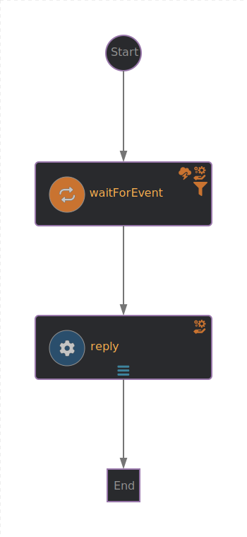

# Events workflow
The events workflow is a hello world kind of workflow for eventing: it waits for an event and once it receives, it sends another one

## Workflow application configuration
Application properties can be initialized from environment variables before running the application: None

## Pre-requisites
When deploying on OCP cluster, [eventing communication](https://github.com/rhdhorchestrator/orchestrator-helm-operator/blob/main/docs/release-1.4/eventing-communication/README.md) must be enabled.

> [!NOTE]
> Currently this workflow is only usable when deployed on a cluster with
> * RHDH
> * Orchestrator plugin 
> * Serverless Logic (Sonataflow) operator
> * Serverless (Knative) operator
> The docker-compose folder may be used to locally deploy Kafka and PSQL but the produced event will not be processed by the server producing/listening for cloudevents, see https://github.com/apache/incubator-kie-kogito-examples/tree/main/serverless-workflow-examples/serverless-workflow-callback-quarkus for more information


## Input
No needed input

## Workflow diagram


## Installation

Use the scripts:
* Build and push the image:
```
cd ..
WORKFLOW_ID=basic WORKFLOW_FOLDER=05_events WORKFLOW_IMAGE_REGISTRY=quay.io WORKFLOW_IMAGE_NAMESPACE=orchestrator ./scripts/build-push.sh
```
* Generate manifests that have to be applied on the OCP cluster wiht RHDH and OSL:
```
WORKFLOW_ID=basic WORKFLOW_FOLDER=05_events WORKFLOW_IMAGE_REGISTRY=quay.io WORKFLOW_IMAGE_NAMESPACE=orchestrator ./scripts/gen-manifest.sh
```
The manifests location will be displayed by the script.

To apply the manifests, run:
```
TARGET_NS=sonataflow-infra
oc -n ${TARGET_NS} apply -f <path to manifests folder>/00-secret_*.yaml
oc -n ${TARGET_NS} apply -f <path to manifests folder>/02-configmap_*-props.yaml
oc -n ${TARGET_NS} apply -f <path to manifests folder>/01-sonataflow_*.yaml
```

Then deploy the server producing and listening for cloudevents:
```
oc -n ${TARGET_NS} apply -f 05_events/server_resources/deployment.yaml
```
> [!NOTE]
> This deployment uses our image, if you want to rebuild your own, execute 05_events/server_resources/build-image.sh

When eventing communication is enabled, the Serverless Logic operator will create the resources needed for the workflow to work:
* `sinkbinding`: they will injec the `K_SINK` value into the workflow deployment with the broker URL value
* `trigger`: they will route the cloudevents to the workflow. Only events consumed by the workflow will have a trigger resource created.

For events produced by the workflow, a `trigger` must be created so the cloudevent will be routed to the application consuming this event. 
Execute the following to create the trigger for the cloudevent server:
```
oc -n ${TARGET_NS} apply -f 05_events/knative_resources/trigger.yaml
```
Note that the trigger and the broker must be in the same namespace.

Now to trigger the workflow, from within the `cloudevent-listener` pod, send a `POST` request to the server:
```
BROKER_URL=$(oc -n ${TARGET_NS} get broker -o yaml | yq -r .items[0].status.address.url)
curl -XPOST "http://localhost:8080/trigger?source=manual&type=wait&broker_url=${BROKER_URL}"
```
You can also expose a route for the `cloudevent-listener` so you can trigger the event from outside the pod.

`BROKER_URL` is populated with a command assuming the broker is in the same namespace as the workflow. If that is not the case, update the command with your value. 
> [!WARNING]
> The `sontaflow-infra ` namespace has `NetworkPolicies` in place to prevent access from unknown/unauthorized namespace/pods. If the broker is not in the same namespace as the workflow, you may need to add a new `NetworkPolicy` to allow access from the broker's namespace.