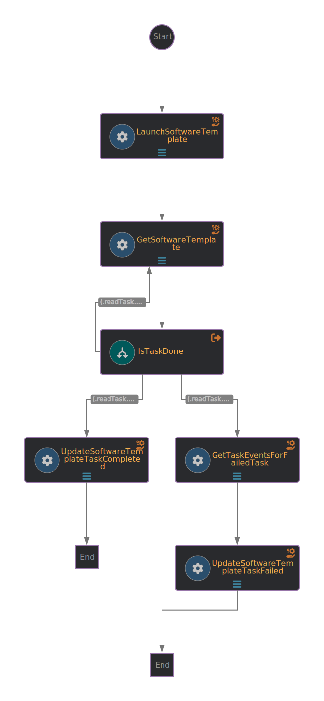

# Software Template workflow
This projects aims to demonstate how a software template from Backstage can be use to invoke an Orchestrator workflow.
To make things a bit more interesting, the orchestrator workflow will be used to launch the hello-world software template.

To keep the workflow simple, there is no use of the notifications plugins, so all results should be viewed from the Orchestrator plugin.

# Prerequisites
RHDH 1.5 and Orchestrator 1.5

## Workflow application configuration
The workflow invokes a software template that will be create a repository in GitHub with sample code.
The GitHub organization, repository, service name and component owner will be provided as input parameters.

Application properties can be initialized from environment variables before running the application:

| Environment variable  | Description | Mandatory | Default value |
|-----------------------|-------------|-----------|---------------|
| `RHDH_URL`      | The backstage server URL for notifications | ✅ | |
| `SCAFFOLDER_BEARER_TOKEN`      | The authorization bearer token to use to send notifications | ✅ | |

## Input
- `Organization Name` [required] - the GitHub organizaion of the target reposiory
- `Repository Name` [required] - the GitHub repository name under the specified organization
- `Service Name` [required] - the name of the service and also used as the name of the component that will be registered in RHDH catalog.
- `Owner` [required] - Backstage owner of the created service and the component (e.g. user:default/guest)

## Workflow diagram


## Installation

To build the workflow image and push it to the image registry, use the [./scripts/build.sh](../scripts/build.sh) script:
```bash
This script performs the following tasks in this specific order:
1. Generates a list of Operator manifests for a SonataFlow project using the kn-workflow plugin (requires at least v1.35.0)
2. Builds the workflow image using podman or docker
3. Optionally, deploys the application:
    - Pushes the workflow image to the container registry specified by the image path
    - Applies the generated manifests using kubectl in the current k8s namespace

Usage: 
    ./scripts/build.sh [flags]

Flags:
    -i|--image=<string> (required)       The full container image path to use for the workflow, e.g: quay.io/orchestrator/demo.
    -b|--builder-image=<string>          Overrides the image to use for building the workflow image.
    -r|--runtime-image=<string>          Overrides the image to use for running the workflow.
    -n|--namespace=<string>              The target namespace where the manifests will be applied. Default: current namespace.
    -m|--manifests-directory=<string>    The operator manifests will be generated inside the specified directory. Default: 'manifests' directory in the current directory.
    -w|--workflow-directory=<string>     Path to the directory containing the workflow's files (the 'src' directory). Default: current directory.
    -P|--no-persistence                  Skips adding persistence configuration to the sonataflow CR.
       --deploy                          Deploys the application.
    -h|--help                            Prints this help message.

Notes: 
    - This script respects the 'QUARKUS_EXTENSIONS' and 'MAVEN_ARGS_APPEND' environment variables.
```

1. Build the image and generate the manifests from workflow's directory (replace the target image):
```
../../scripts/build.sh --image=quay.io/orchestrator/demo-software-template-hello-world
```

The manifests location will be displayed by the script, or at the given location by the `--manifests-directory` flag
2. Push the image
```
POCKER=$(command -v podman || command -v docker) "$@"
$POCKER push <image>
```

3. Apply the manifests:
The generated manifests from the previous commands are included in this repository at `./workflow/manifests`.
```
TARGET_NS=sonataflow-infra
oc -n ${TARGET_NS} create -f .
```

All the previous steps can be done together by running:
```
../../scripts/build.sh --image=quay.io/orchestrator/demo-software-template-hello-world --deploy
```

Once the manifests are deployed, set the environements variables needed.

### Add the Environment Variables to a Secret

Run the following command to update the Secret. Replace the example values with
the correct values for your environment:

```bash
export TARGET_NS='sonataflow-infra'
export WORKFLOW_NAME='software-template-workflow'

export SCAFFOLDER_BEARER_TOKEN=$(oc get secrets -n rhdh-operator backstage-backend-auth-secret -o go-template='{{ .data.BACKEND_SECRET  }}' | base64 -d)
export RHDH_URL=http://backstage-backstage.rhdh-operator
```

Now, patch the Secret with these values:

```bash
oc -n $TARGET_NS patch secret "$WORKFLOW_NAME-secrets" \
  --type merge -p "{ \
    \"stringData\": { \
      \"SCAFFOLDER_BEARER_TOKEN\": \"$SCAFFOLDER_BEARER_TOKEN\",
      \"RHDH_URL\": \"$RHDH_URL\"
    }
  }"
```

After changing the secret, the workflow's pod must be restarted manually to ensure the values we set previsously in the secret are correctly applied:
```
oc -n $TARGET_NS scale deploy $WORKFLOW_NAME --replicas=0 && oc -n $TARGET_NS scale deploy $WORKFLOW_NAME --replicas=1
```

