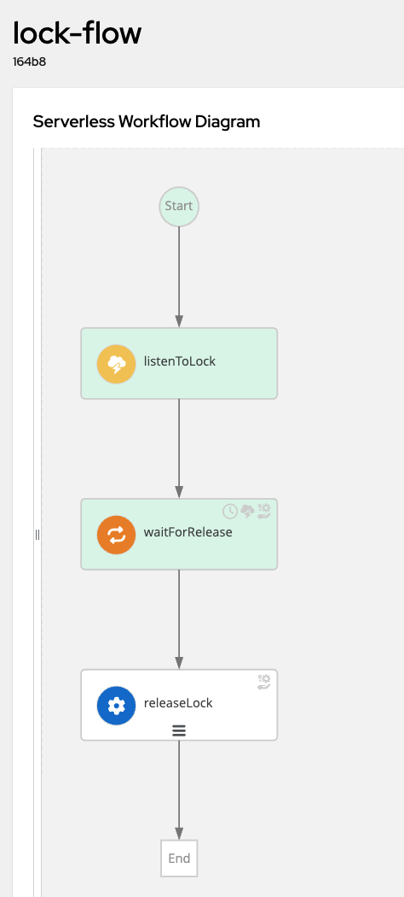
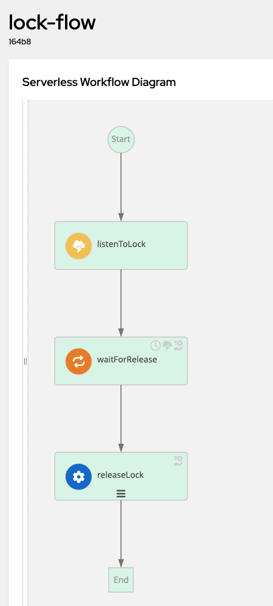

# How to Send and Receive Kafka Messages in [SonataFlow Workflows](https://sonataflow.org)

## **📌 Summary**

This guide explains how to integrate **Kafka messaging** into a **SonataFlow workflow application** using the **Quarkus SmallRye Kafka Connector**. It covers:

- Defining and handling workflow events
- Ensuring event correlation within workflow instances
- Configuring Kafka topics and CloudEvents format
- Running unit tests to validate workflow execution
- Deploying and testing the workflow in both local and Kubernetes environments

By following this guide, you will learn how to configure **Apache Kafka** to send and receive events, enable event-driven workflow execution, and deploy the entire solution within a **scalable Kubernetes environment**.

For a deeper dive into the deployment process, refer to the accompanying [blog post](https://www.rhdhorchestrator.io/blog/hacking-build-process/).

---

## **📌 Understanding the Event Definitions**

The [workflow specification](callback-flow/src/main/resources/lock.sw.yaml) defines three key events:

```yaml
events:
  - type: lock-event
    kind: consumed
    name: lock-event
    source: local
    correlation:
      - contextAttributeName: lockid
  - type: release-event
    kind: consumed
    name: release-event
    source: local
    correlation:
      - contextAttributeName: lockid
  - type: released-event
    kind: produced
    name: released-event
    correlation:
      - contextAttributeName: lockid
```

### **🔹 Event Breakdown**
1. **`lock-event`** → Triggers the workflow execution.
2. **`release-event`** → Releases the lock, resuming the workflow.
3. **`released-event`** → Workflow emits this event upon termination.

SonataFlow only accepts messages in the [CloudEvents](https://cloudevents.io/) format. Here’s an example of a **valid CloudEvent JSON message**:

```json
{
  "specversion": "1.0",
  "id": "db16ff44-5b0b-4abc-88f3-5a71378be171",
  "source": "http://dev.local",
  "type": "lock-event",
  "datacontenttype": "application/json",
  "time": "2025-03-07T15:04:32.327635-05:00",
  "lockid": "03471a81-310a-47f5-8db3-cceebc63961a",
  "data": {
    "name": "The Kraken",
    "id": "03471a81-310a-47f5-8db3-cceebc63961a"
  }
}
```

### **🔹 Correlation in SonataFlow**
Each event definition contains `correlation.contextAttributeName`, which enables **event correlation** across workflow instances.

For example, if **10 workflows** are waiting for the `release-event`, SonataFlow will match incoming events by their `lockid` attribute to **resume only the relevant workflow instance**.

Additionally, Kafka topics are mapped to event **types**. By default, topics are named based on event types:
- `lock-event`
- `release-event`
- `released-event`

To customize the Kafka topic name, override it in **`application.properties`**:
```properties
mp.messaging.incoming.lock-event.topic=MySuperFancyTopicName
```

---

## **🛠 Running the Tests**

To better understand this example, you can run the **unit tests** located in:
- [TestWorkflowMessaging.java](callback-flow/src/test/java/org/acme/poc/sonataflow/kafka/TestWorkflowMessaging.java)

Run the tests using Maven:
```shell
cd callback-flow
mvn clean install
```

### **✅ Expected Output (Logs)**
When executed successfully, the workflow logs will show something like:

```log
INFO  [kogito-event-executor-1] Starting new process instance with signal 'lock-event'
INFO  [kogito-event-executor-1] Workflow data change
{
  "name": "The Kraken",
  "id": "3fc919e7-0ff8-45cf-b935-15d52e486b98"
}
INFO  [kogito-event-executor-1] Waiting lock release The Kraken
INFO  [kogito-event-executor-1] Lock The Kraken released
INFO  [kogito-event-executor-1] Workflow 'lock-flow' (e6054a8a-6623-4eed-a25a-583194572745) completed
```

### **🔹 Quarkus DevServices for Kafka**
Quarkus automatically starts a **lightweight Kafka broker** in test mode:

```properties
%test.quarkus.kafka.devservices.enabled=true
%test.quarkus.kafka.devservices.provider=kafka-native
%test.quarkus.kafka.devservices.topic-partitions.release-event=1
%test.quarkus.kafka.devservices.topic-partitions.lock-event=1
%test.quarkus.kafka.devservices.topic-partitions.released-event=1
```

---

## **🚀 Running the Workflow in Dev Mode**

### 1️⃣ Start a Kafka Instance

| Option | Security level                                 |
|:------:|------------------------------------------------|
| **A**  | Plain (no authentication)                      |
| **B**  | One‑Way TLS (broker authenticated only)        |
| **C**  | Mutual TLS (both broker **and** client auth)   |

### 🔓 Option A: Plain (No Authentication)

**Run the broker:**
```bash
docker run -it --rm --name kafka \
  -p 9092:9092 \
  -e KAFKA_CFG_NODE_ID=0 \
  -e KAFKA_CFG_PROCESS_ROLES=controller,broker \
  -e KAFKA_CFG_CONTROLLER_QUORUM_VOTERS=0@localhost:9093 \
  -e KAFKA_CFG_LISTENERS=PLAINTEXT://0.0.0.0:9092,CONTROLLER://0.0.0.0:9093 \
  -e KAFKA_CFG_ADVERTISED_LISTENERS=PLAINTEXT://localhost:9092,CONTROLLER://localhost:9093 \
  -e KAFKA_CFG_LISTENER_SECURITY_PROTOCOL_MAP=PLAINTEXT:PLAINTEXT,CONTROLLER:PLAINTEXT \
  -e KAFKA_CFG_CONTROLLER_LISTENER_NAMES=CONTROLLER \
  -e KAFKA_CFG_INTER_BROKER_LISTENER_NAME=PLAINTEXT \
  bitnami/kafka:latest
```

**Quarkus `application.properties`:**
```properties
# bootstrap the client
%dev.kafka.bootstrap.servers=localhost:9092

# no TLS at all
%dev.mp.messaging.connector.smallrye-kafka.security.protocol=PLAINTEXT
```

### 🔐 Option B: One‑Way TLS (Server Authentication Only)

> The broker presents its cert; the client only **trusts** it, no client cert required.

**Run the broker:**
```bash
export KAFKA_TRUSTSTORE_PATH=/path/to/your/certs

docker run -it --rm --name kafka \
  -p 9092:9092 -p 9093:9093 -p 9094:9094 \
  -v $KAFKA_TRUSTSTORE_PATH/kafka.server.keystore.jks:/bitnami/kafka/config/certs/kafka.keystore.jks \
  -v $KAFKA_TRUSTSTORE_PATH/kafka.server.truststore.jks:/bitnami/kafka/config/certs/kafka.truststore.jks \
  -e KAFKA_CFG_NODE_ID=0 \
  -e KAFKA_CFG_PROCESS_ROLES=controller,broker \
  -e KAFKA_CFG_CONTROLLER_QUORUM_VOTERS=0@localhost:9094 \
  -e KAFKA_CFG_LISTENERS=PLAINTEXT://0.0.0.0:9092,SSL://0.0.0.0:9093,CONTROLLER://0.0.0.0:9094 \
  -e KAFKA_CFG_ADVERTISED_LISTENERS=PLAINTEXT://localhost:9092,SSL://localhost:9093,CONTROLLER://localhost:9094 \
  -e KAFKA_CFG_LISTENER_SECURITY_PROTOCOL_MAP=PLAINTEXT:PLAINTEXT,SSL:SSL,CONTROLLER:PLAINTEXT \
  -e KAFKA_CFG_INTER_BROKER_LISTENER_NAME=PLAINTEXT \
  -e KAFKA_CFG_SSL_KEYSTORE_LOCATION=/bitnami/kafka/config/certs/kafka.keystore.jks \
  -e KAFKA_CFG_SSL_KEYSTORE_PASSWORD=changeit \
  -e KAFKA_CFG_SSL_TRUSTSTORE_LOCATION=/bitnami/kafka/config/certs/kafka.truststore.jks \
  -e KAFKA_CFG_SSL_TRUSTSTORE_PASSWORD=changeit \
  -e KAFKA_CFG_SSL_CLIENT_AUTH=none \
  bitnami/kafka:latest
```

**Quarkus `application.properties`:**
```properties
%dev.kafka.bootstrap.servers=localhost:9093

mp.messaging.connector.smallrye-kafka.security.protocol=SSL
mp.messaging.connector.smallrye-kafka.ssl.enabled.protocols=TLSv1.2

# trust only the broker’s cert
mp.messaging.connector.smallrye-kafka.ssl.truststore.location=${KAFKA_TRUSTSTORE_PATH}/kafka.server.truststore.jks
mp.messaging.connector.smallrye-kafka.ssl.truststore.password=changeit

# do NOT enable client‐side keystore here
# mp.messaging.connector.smallrye-kafka.ssl.keystore.location=...
# mp.messaging.connector.smallrye-kafka.ssl.keystore.password=...
# mp.messaging.connector.smallrye-kafka.ssl.key.password=...
```

### 🔑 Option C: Mutual TLS (Two‑Way Authentication)

> Both broker **and** client present certificates.

**Run the broker:**
```bash
export KAFKA_TRUSTSTORE_PATH=/path/to/your/certs

docker run -it --rm --name kafka \
  -p 9092:9092 -p 9093:9093 -p 9094:9094 \
  -v $KAFKA_TRUSTSTORE_PATH/kafka.server.keystore.jks:/bitnami/kafka/config/certs/kafka.keystore.jks \
  -v $KAFKA_TRUSTSTORE_PATH/kafka.server.truststore.jks:/bitnami/kafka/config/certs/kafka.truststore.jks \
  -e KAFKA_CFG_NODE_ID=0 \
  -e KAFKA_CFG_PROCESS_ROLES=controller,broker \
  -e KAFKA_CFG_CONTROLLER_QUORUM_VOTERS=0@localhost:9094 \
  -e KAFKA_CFG_LISTENERS=PLAINTEXT://0.0.0.0:9092,SSL://0.0.0.0:9093,CONTROLLER://0.0.0.0:9094 \
  -e KAFKA_CFG_ADVERTISED_LISTENERS=PLAINTEXT://localhost:9092,SSL://localhost:9093,CONTROLLER://localhost:9094 \
  -e KAFKA_CFG_LISTENER_SECURITY_PROTOCOL_MAP=PLAINTEXT:PLAINTEXT,SSL:SSL,CONTROLLER:PLAINTEXT \
  -e KAFKA_CFG_INTER_BROKER_LISTENER_NAME=PLAINTEXT \
  -e KAFKA_CFG_SSL_KEYSTORE_LOCATION=/bitnami/kafka/config/certs/kafka.keystore.jks \
  -e KAFKA_CFG_SSL_KEYSTORE_PASSWORD=changeit \
  -e KAFKA_CFG_SSL_TRUSTSTORE_LOCATION=/bitnami/kafka/config/certs/kafka.truststore.jks \
  -e KAFKA_CFG_SSL_TRUSTSTORE_PASSWORD=changeit \
  -e KAFKA_CFG_SSL_CLIENT_AUTH=required \
  bitnami/kafka:latest
```

**Quarkus `application.properties`:**
```properties
%dev.kafka.bootstrap.servers=localhost:9093

mp.messaging.connector.smallrye-kafka.security.protocol=SSL
mp.messaging.connector.smallrye-kafka.ssl.enabled.protocols=TLSv1.2

# trust the broker
mp.messaging.connector.smallrye-kafka.ssl.truststore.location=${KAFKA_TRUSTSTORE_PATH}/kafka.server.truststore.jks
mp.messaging.connector.smallrye-kafka.ssl.truststore.password=changeit

# client cert for mutual TLS
mp.messaging.connector.smallrye-kafka.ssl.keystore.location=${KAFKA_TRUSTSTORE_PATH}/kafka.server.keystore.jks
mp.messaging.connector.smallrye-kafka.ssl.keystore.password=changeit
mp.messaging.connector.smallrye-kafka.ssl.key.password=changeit
```

## **🚀 Running the Workflow in Dev Mode (Common Steps)**

### **1️⃣ Start Kafka**

Choose one of the above Docker commands (Option A, Option B, or Option C) to launch Kafka with your desired SSL configuration.

### **2️⃣ Start the Quarkus Application**
```shell
cd callback-flow
mvn clean quarkus:dev
```

### **3️⃣ Send Events to Kafka**
```shell
cat kafka-messages/lock-event.json | docker exec -i kafka kafka-console-producer.sh \
  --bootstrap-server localhost:9092 \
  --topic lock-event
```

### **4️⃣ Verify Workflow Completion**
Refresh the **SonataFlow DevUI Console** to see the workflow state:



Send the `release-event` to resume execution:
```shell
cat kafka-messages/release-event.json | docker exec -i kafka kafka-console-producer.sh \
  --bootstrap-server localhost:9092 \
  --topic release-event
```



### **5️⃣ Stop Kafka**
```shell
docker container stop kafka
```

---

## 🏗 Running the Workflow in a Kubernetes Cluster

Deploying the workflow in a Kubernetes cluster allows it to integrate seamlessly with other microservices and event-driven systems. Follow these steps to set up a Kafka instance, configure SonataFlow, and interact with the workflow in a Kubernetes environment.

### 🔹 Deploy Kafka in Kubernetes
Kafka serves as the messaging backbone for the workflow. Deploy a single-node Kafka instance using Bitnami Helm charts:

```shell
helm repo add bitnami https://charts.bitnami.com/bitnami
helm repo update
helm install kafka bitnami/kafka -f manifests/kafka/values.yaml
```

Once installed, verify that the Kafka broker is running:

```shell
kubectl get pods
```

Expected output:
```shell
NAME                           READY   STATUS    RESTARTS   AGE
kafka-controller-0             1/1     Running   0          5m
```

### 🔹 Deploy SonataFlowPlatform
SonataFlow requires a platform resource to manage workflow execution. Apply the following Kubernetes manifest to set up the **SonataFlowPlatform**:

```shell
kubectl apply -f manifests/00-sonataflow-platform.yaml
```

This resource defines necessary configurations, including Kafka integration details. Ensure it is running:

```shell
kubectl get sonataflowplatform
```

Expected output:
```shell
NAME                   STATUS    AGE
sonataflow-platform    Ready     2m
```

### 🔹 Deploy the Workflow Application
Deploy the workflow application to the Kubernetes cluster by applying the necessary configuration and workflow manifests:

```shell
kubectl apply -f manifests/01-configmap_lock-flow-props.yaml
kubectl apply -f manifests/02-sonataflow_lock-flow.yaml
```

These manifests define the workflow logic and configure event-based communication between Kafka and the workflow engine.

Monitor the deployment progress:

```shell
kubectl get pods
```

Expected output (once ready):
```shell
NAME                           READY   STATUS      RESTARTS   AGE
kafka-controller-0             1/1     Running     0          10m
lock-flow-78df85ff6b-xyz12     1/1     Running     0          1m
```

### 🔹 Sending Events to the Workflow
With Kafka and the workflow application running, you can now send events and observe the workflow execution in real-time.

#### **Monitor Workflow Logs**
Open a new terminal and follow the logs of the running workflow pod:
```shell
kubectl logs -f <workflow-pod-name>
```

#### **Send a `lock-event` to Trigger Execution**
Send a `lock-event` message to Kafka, initiating a workflow instance:
```shell
cat kafka-messages/lock-event.json | kubectl exec -i kafka-controller-0 -- kafka-console-producer.sh \
  --bootstrap-server localhost:9092 \
  --topic lock-event
```

Once sent, you should see logs confirming workflow execution:
```shell
INFO  [kogito-event-executor-1] Starting new process instance with signal 'lock-event'
INFO  [kogito-event-executor-1] Lock received: The Kraken
INFO  [kogito-event-executor-1] Waiting lock release: The Kraken
```

#### **Send a `release-event` to Resume Workflow Execution**
```shell
cat kafka-messages/release-event.json | kubectl exec -i kafka-controller-0 -- kafka-console-producer.sh \
  --bootstrap-server localhost:9092 \
  --topic release-event
```

Expected logs:
```shell
INFO  [kogito-event-executor-1] Lock The Kraken released
INFO  [kogito-event-executor-1] Workflow completed successfully
```

#### **Verify the `released-event` in Kafka**
To confirm the workflow emitted the expected event, consume messages from the `released-event` topic:
```shell
kubectl exec -it kafka-controller-0 -- kafka-console-consumer.sh \
  --bootstrap-server kafka.default.svc.cluster.local:9092 \
  --topic released-event --from-beginning
```

Example output:
```json
{"specversion":"1.0","id":"173ce9f2-b9d8-46de-815e-1abb48221607","source":"/process/lock-flow","type":"released-event","time":"2025-03-11T23:18:15.123Z","lockid":"03471a81-310a-47f5-8db3-cceebc63961a","data":{"name":"The Kraken","id":"86ebe1ee-9dd2-4e9b-b9a2-38e865ef1792"}}
```

---
